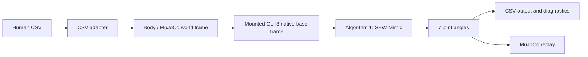

# SEW-Mimic Reproduction for Kinova Gen3

This repository is a focused Python reproduction of the geometric retargeting
core from the paper **"A Closed-Form Geometric Retargeting Solver for Upper
Body Humanoid Robot Teleoperation."** It maps a human upper-body pose

```text
(shoulder position, elbow position, wrist position, hand orientation)
```

to seven Kinova Gen3 arm joint angles:

```text
q = [q1, q2, q3, q4, q5, q6, q7]
```

The implementation uses NumPy and SciPy for the closed-form geometry and the
MuJoCo Menagerie Kinova Gen3 model for model-derived kinematics and
visualization. It is intended for Windows and Python 3.11.

## Scope

Implemented:

- Paper Algorithm 1: `SEW-Mimic`
- Paper Algorithm 2: `AlignAxis`
- Paper Algorithm 3: `AlignWrist` for the Gen3 parallel-wrist formulation
- Appendix Algorithm 5: Subproblem 1 (`SP1`)
- Appendix Algorithm 6: Subproblem 2 (`SP2`)
- Appendix Algorithm 7: Subproblem 4 (`SP4`)
- Rodrigues rotation formula
- Model-derived Kinova Gen3 forward kinematics
- Human CSV coordinate and wrist-frame adaptation
- Fixed humanoid-like right-arm mounting in MuJoCo
- Single-pose, self-consistency, wrist, trajectory, and replay diagnostics
- Per-frame CSV retargeting using the previous solution as the next initial
  configuration

Intentionally out of scope:

- Safety Filter
- Collision avoidance
- Numerical or Jacobian inverse kinematics
- Smoothing or trajectory optimization
- User study reproduction
- Policy or imitation learning
- ROS and real-robot control

The closed-form solver does not call `scipy.optimize` and does not fall back to
a numerical IK method.

## Pipeline



For each frame, Algorithm 1 performs:

```text
u = unit(elbow - shoulder)
l = unit(wrist - elbow)

q1, q2     <- AlignAxis(3, q, u)
q3, q4     <- AlignAxis(5, q, l)
q5, q6, q7 <- AlignWrist(q, H)
```

For trajectories, the branch-continuity rule is:

```python
q_t = sew_mimic(q_previous, shoulder_t, elbow_t, wrist_t, H_t)
```

`AlignAxis` filters solutions that violate joint limits and selects the valid
closed-form branch closest to the current configuration.

## Repository Layout

```text
config.yaml                     Unified project configuration
requirements.txt                Python dependencies

src/sew_mimic/
    config.py                   YAML loading and project-relative paths
    geometry.py                 Rodrigues rotation, SP1, SP2, and SP4
    human_input.py              Direction and general frame helpers
    csv_adapter.py              CSV position and wrist-frame conversion
    kinematics.py               Model-derived Gen3 FK and tool convention
    mounting.py                 Fixed root rotation/translation in MuJoCo
    retarget.py                 Algorithms 1, 2, and 3
    metrics.py                  Alignment and joint-limit diagnostics

scripts/
    show_gen3.py                Inspect joints, axes, limits, and bodies
    show_right_arm_mounting.py  Inspect the q=0 humanoid mounting
    validate_first_frame.py     Detailed first-frame geometric diagnostic
    validate_wrist_alignment.py Independent wrist/tool-frame validation
    test_self_consistency.py    Random FK-to-SEW consistency test
    replay_trajectory.py        Synthetic trajectory generation and replay
    replay_csv.py               Complete human CSV retargeting and replay
    test_single_pose.py         Single-pose script placeholder
    benchmark.py                Benchmark script placeholder

tests/                          Unit and integration tests
data/test.csv                   Current processed human trajectory
assets/kinova_gen3/             MuJoCo Menagerie Kinova Gen3 model
paper/sew_mimic.pdf             Local copy of the reference paper
output/                         Generated CSV files, figures, and screenshots
```

## Installation on Windows

From the project root in PowerShell:

```powershell
py -3.11 -m venv .venv
.venv\Scripts\python.exe -m ensurepip
.venv\Scripts\python.exe -m pip install -r requirements.txt
```

The runtime dependencies are:

- NumPy
- SciPy
- pandas
- Matplotlib
- MuJoCo 3.1.6
- PyYAML
- pytest

Run the import smoke test:

```powershell
.venv\Scripts\python.exe -m pytest tests\test_smoke.py -q
```

Run the complete test suite:

```powershell
.venv\Scripts\python.exe -m pytest -q
```

## Unified Configuration

All user-facing runtime, coordinate-frame, mounting, path, replay, and
diagnostic defaults are stored in [`config.yaml`](config.yaml). Relative paths
are resolved from the project root. The file is loaded when `sew_mimic` modules
are imported, so restart the Python process after changing it.

The most commonly adjusted setting is the complete robot world translation:

```yaml
robot:
  world_offset_m: [0.0, 0.0, 0.2]
```

The three values are MuJoCo world-frame `[x, y, z]` offsets in metres. The
current configuration raises the complete robot by 0.2 m. Set it to
`[0.0, 0.0, 0.0]` for no extra displacement.

This translation affects only the Gen3 root pose. It does not modify:

- human CSV positions;
- the Gen3 root orientation;
- internal link transforms;
- native joint axes;
- joint limits; or
- the SEW-Mimic equations.

Parameters such as `mounting_name`, `joint1_in_base_m`, proxy signs, coordinate
rotation matrices, and wrist alignment describe the validated robot/input
conventions. Change them only when the robot model or tracking convention
actually changes. Numerical degeneracy tolerances and test tolerances remain in
the implementation because they are correctness conditions rather than runtime
configuration.

The core mounting API also accepts an explicit override:

```python
robot, data = load_humanoid_mounted_gen3(
    human_shoulder_world,
    robot_world_offset=(0.0, 0.0, 0.3),
)
```

The robot offset is intentionally not exposed as a `replay_csv.py` command-line
option. Replay obtains its default from the central YAML configuration.

## Coordinate Frames

### Processed human CSV frame

The verified processed CSV convention is:

```text
+X_csv = human left
+Y_csv = up
+Z_csv = forward
```

### Canonical body / MuJoCo world frame

```text
+X_world = forward
+Y_world = left
+Z_world = up
```

The configured proper rotation is:

```python
R_body_from_csv = np.array([
    [0.0, 0.0, 1.0],
    [1.0, 0.0, 0.0],
    [0.0, 1.0, 0.0],
])
```

It satisfies:

```text
det(R_body_from_csv) = +1
R_body_from_csv.T @ R_body_from_csv = I
```

CSV positions are converted as absolute coordinates:

```python
p_world = R_body_from_csv @ (position_scale_to_m * p_csv)
```

With millimetre input, `position_scale_to_m` is `0.001`.

### Mounted Gen3 native base frame

The closed-form solver and its model-derived FK use the native Gen3 base frame.
Human targets adapted into the body/world frame must therefore be converted
before calling the core solver:

```text
u_base = R_body_from_base.T @ u_body
l_base = R_body_from_base.T @ l_body
H_base = R_body_from_base.T @ H_body
```

The replay pipeline performs the equivalent point and orientation transform in
`world_trajectory_to_base()`. Do not pass body/world-frame vectors directly to
`sew_mimic()` unless the native base and body frames are identical.

## Human Hand Orientation

The canonical hand frame follows the paper convention:

```text
X = hand/index-finger pointing direction
Y = palm normal
Z = thumb direction
```

The current processed `Wrist_Rx`, `Wrist_Ry`, and `Wrist_Rz` columns are read
using the convention configured in `config.yaml`. The current settings are:

```yaml
wrist_euler_order: xyz
wrist_euler_degrees: true
wrist_euler_convention: extrinsic
```

For extrinsic XYZ angles, the rotation matrix is equivalent to:

```python
R_wrist_csv = Rz(rz) @ Ry(ry) @ Rx(rx)
```

The complete wrist conversion is:

```python
H_body_raw = R_body_from_csv @ R_wrist_csv
H_body = H_body_raw @ R_input_align
H_base = R_body_from_base.T @ H_body
```

`R_input_align` is the fixed Motive rigid-body-frame to canonical human-hand
alignment. It is kept separate from the model-derived Gen3
`R_robot_align`; one must not be tuned to compensate for an error in the other.

## Kinova Gen3 Kinematics and Mounting

The robot is loaded from the bundled MuJoCo Menagerie model. The implementation
extracts the following directly from MuJoCo rather than guessing them:

- seven controlled revolute joints;
- native joint axes;
- fixed parent-to-child transforms;
- joint limits;
- joint and body names;
- the `pinch_site` tool transform.

Custom FK is checked against MuJoCo FK. The public FK methods are:

```python
robot.R_0_i(q, i)
robot.T_0_i(q, i)
robot.ee_rotation(q)
robot.aligned_ee_rotation(q)
```

The fixed humanoid right-arm mounting is:

```text
R_body_from_base = Rx(+90 degrees)
```

This maps the native Gen3 `+Z` direction toward body/world `-Y`, corresponding
to the human right side. `joint_1` is treated as the robot shoulder. Its native
base offset is:

```text
joint1_in_base = [0.0, 0.0, 0.15643] m
```

The root translation is computed as:

```text
robot_shoulder_world = human_first_shoulder_world + robot_world_offset

base_world = robot_shoulder_world
             - R_body_from_base @ joint1_in_base
```

Only the complete root pose is changed. No internal Gen3 link or joint
transform is modified.

### Limb proxy conventions

The native positive h3 and h5 axes are rotation-axis conventions, not direct
anatomical limb-pointing conventions. Geometry tests over random valid Gen3
configurations established:

```text
upper-arm proxy = -h3_native
lower-arm proxy = -h5_native
```

The configured proxy signs are therefore both `-1.0`. Native h3 and h5 remain
unchanged whenever they are used as actual revolute rotation axes.

## Closed-Form Geometry

`geometry.py` contains independent, optimizer-free implementations of:

- `rot(axis, theta)` using Rodrigues' formula;
- `sp1(p1, p2, k)`;
- `sp2(p1, p2, k1, k2)`; and
- `sp4(p, h, k, d)`.

Input axes are normalized internally. Degenerate geometry is rejected
explicitly. Tests check final geometric residuals rather than only comparing
angles, because closed-form angle solutions are periodic and may have multiple
equivalent branches.

For Appendix Algorithm 7, line 5 is implemented using the agreed
paper-reference interpretation:

```text
x_tilde = A.T @ b
```

The implementation was cross-checked conceptually against IK-Geo, but remains
independent and local to this project.

## Core Python API

The lowest-level retargeting call is:

```python
from sew_mimic.retarget import sew_mimic

q, diagnostics = sew_mimic(
    q0,
    shoulder_base,
    elbow_base,
    wrist_base,
    H_base,
)
```

Inputs:

- `q0`: current/previous seven-joint configuration in radians;
- `shoulder_base`, `elbow_base`, `wrist_base`: finite 3D points expressed in
  the native mounted Gen3 base frame;
- `H_base`: canonical right-handed hand orientation in that same base frame.

Outputs:

- `q`: seven joint angles in radians;
- `diagnostics`: a dictionary containing:

```text
upper_arm_error_deg
lower_arm_error_deg
wrist_rotation_error_deg
joint_limit_valid
```

The solver may raise `ValueError` if the input is degenerate or if no
closed-form branch satisfies the Gen3 joint limits.

## CSV Format

The adapter requires these columns:

```text
Shoulder_X Shoulder_Y Shoulder_Z
Elbow_X    Elbow_Y    Elbow_Z
Wrist_X    Wrist_Y    Wrist_Z
Wrist_Rx   Wrist_Ry   Wrist_Rz
```

`scripts/replay_csv.py` also uses these trajectory-segmentation columns from the
current dataset:

```text
bite_id motive_frame event event_frame_index
```

They allow discontinuities between labeled events to be excluded from the
within-segment branch-jump report.

## Typical Workflow

### 1. Inspect the Gen3 model

```powershell
.venv\Scripts\python.exe scripts\show_gen3.py
```

Headless inspection:

```powershell
.venv\Scripts\python.exe scripts\show_gen3.py --no-viewer
```

This prints all revolute joints, axes, joint limits, controlled joints, and
body/link names.

### 2. Inspect the humanoid right-arm mounting

```powershell
.venv\Scripts\python.exe scripts\show_right_arm_mounting.py
```

The viewer marks the human shoulder, robot joint-1 shoulder, Gen3 base origin,
the base-to-joint1 offset, and world axes.

### 3. Validate the first human frame

```powershell
.venv\Scripts\python.exe scripts\validate_first_frame.py
```

Headless diagnostic:

```powershell
.venv\Scripts\python.exe scripts\validate_first_frame.py --no-viewer
```

This traces `q0`, upper-arm alignment, lower-arm alignment, and wrist alignment;
prints all relevant coordinate transforms and angular errors; and saves the
configured diagnostic screenshot.

### 4. Validate wrist alignment independently

```powershell
.venv\Scripts\python.exe scripts\validate_wrist_alignment.py
```

This samples valid wrist configurations, reconstructs target tool
orientations, solves them again using `AlignWrist`, and validates the Gen3 final
axis/tool-frame convention.

### 5. Run random FK-to-SEW self-consistency

```powershell
.venv\Scripts\python.exe scripts\test_self_consistency.py
```

The default sample count and random seed are defined in `config.yaml`.

### 6. Replay a synthetic trajectory

```powershell
.venv\Scripts\python.exe scripts\replay_trajectory.py
```

For a headless run:

```powershell
.venv\Scripts\python.exe scripts\replay_trajectory.py --no-viewer --no-show
```

### 7. Retarget and replay the complete CSV

```powershell
.venv\Scripts\python.exe scripts\replay_csv.py
```

For a headless run:

```powershell
.venv\Scripts\python.exe scripts\replay_csv.py --no-viewer
```

The script:

1. loads and validates the configured CSV;
2. converts all human positions and orientations into body/world coordinates;
3. mounts the Gen3 using the fixed root orientation and configured XYZ offset;
4. converts the trajectory into the native Gen3 base frame;
5. runs SEW-Mimic sequentially using the previous frame as `q0`;
6. saves joint angles and alignment errors;
7. plots errors, joint angles, and joint velocities; and
8. optionally replays the result in the MuJoCo viewer.

The output CSV columns are:

```text
q1 q2 q3 q4 q5 q6 q7
upper_arm_error_deg
lower_arm_error_deg
wrist_error_deg
```

## Viewer Legend

The full replay viewer uses:

```text
Human shoulder/elbow/wrist: red/orange/yellow
Robot shoulder/elbow/wrist: blue/cyan/purple
World +X/+Y/+Z:            red/green/blue
Desired tool triad:         red/green/blue
Actual tool triad:          magenta/yellow/cyan
```

World axes follow the body convention: `+X` forward, `+Y` left, and `+Z` up.

## Testing Strategy

The test suite covers:

- random exact-residual tests for Rodrigues rotation and SP1/SP2/SP4;
- degenerate geometry rejection;
- custom FK versus MuJoCo FK over random valid configurations;
- explicit Euler conventions and frame conversion;
- Algorithm 2 solution filtering and nearest-branch selection;
- Algorithm 3 wrist self-consistency and tool alignment;
- Algorithm 1 end-to-end retargeting;
- upper/lower proxy-sign validation over 1000 poses;
- configurable XYZ root offsets;
- sequential use of the previous trajectory solution; and
- dependency import smoke tests.

Use geometric residuals and orientation errors when evaluating correctness.
Direct joint-angle equality is generally not appropriate because revolute
angles are periodic and multiple closed-form branches may represent the same
pose.

## Generated Outputs

Default output locations are configured in `config.yaml`. They currently
include:

```text
output/test_retargeted_mounted.csv
output/test_trajectory_diagnostics.png
output/synthetic_trajectory_diagnostics.png
output/first_frame_geometric_diagnostic.png
```

The full trajectory plot contains:

- upper-arm orientation error over time;
- lower-arm orientation error over time;
- wrist orientation error over time;
- all seven joint angles; and
- all seven joint velocities.

## Reference and Model Attribution

The reference paper is stored locally at
[`paper/sew_mimic.pdf`](paper/sew_mimic.pdf).

The Kinova Gen3 MJCF is stored under `assets/kinova_gen3/` and comes from
MuJoCo Menagerie. See the model's bundled [`README.md`](assets/kinova_gen3/README.md)
and [`LICENSE`](assets/kinova_gen3/LICENSE) for derivation details, attribution,
and license terms.

This repository does not currently define a separate top-level software
license.
